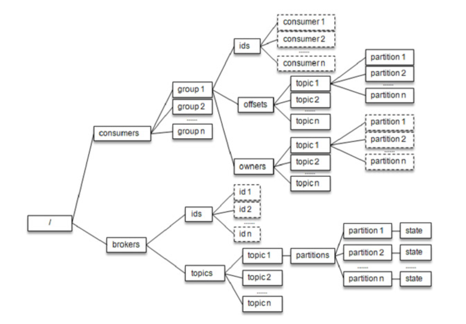

# ConsumerCoordinator与GroupCoordinator

## 旧版消费组简介
消费者协调器（ConsumerCoordinator）和组协调器（GroupCoordinator）的概念是针对新版的消费者客户端而言的，Kafka 建立之初并没有它们。

旧版的消费者客户端是使用ZooKeeper的监听器（Watcher）来实现这些功能的。

这种严重依赖于ZooKeeper集群的做法还有两个比较严重的问题:
- 羊群效应（Herd Effect）：所谓的羊群效应是指ZooKeeper中一个被监听的节点变化，大量的 Watcher 通知被发送到客户端，导致在通知期间的其他操作延迟，也有可能发生类似死锁的情况。
- 脑裂问题（Split Brain）：消费者进行再均衡操作时每个消费者都与ZooKeeper进行通信以判断消费者或broker变化的情况，由于ZooKeeper本身的特性，可能导致在同一时刻各个消费者获取的状态不一致，这样会导致异常问题发生。

## ReBalance的原理介绍
将全部消费组分成多个子集，每个消费组的子集在服务端对应一个GroupCoordinator对其进行管理，GroupCoordinator是Kafka服务端中用于管理消费组的组件。而消费者客户端中的ConsumerCoordinator组件负责与GroupCoordinator进行交互。

ConsumerCoordinator与GroupCoordinator之间最重要的职责就是负责执行消费者再均衡的操作，包括前面提及的分区分配的工作也是在再均衡期间完成的。就目前而言，一共有如下几种情形会触发再均衡的操作：
- 有新的消费者加入消费组
- 有消费者宕机下线。当然也会存在如下情况导致消费者长时间未向GroupCoordinator发送心跳
    - 长时间的 GC
    - 网络延迟
- 消费者主动退出消费组
- 消费组所对应的GroupCoordinator节点发生了变更
- 消费组内所订阅的任一主题或者主题的分区数量发生变化

一个简单的例子来讲解一下再均衡操作的具体内容。当有消费者加入消费组时，消费者、消费组及组协调器之间会经历一下几个阶段:
- 第一阶段（FIND_COORDINATOR）
（源码待补充） 

- 第二阶段（JOIN_GROUP）
（源码待补充） 

- 第三阶段（SYNC_GROUP）

- 第四阶段（HEARTBEAT）

