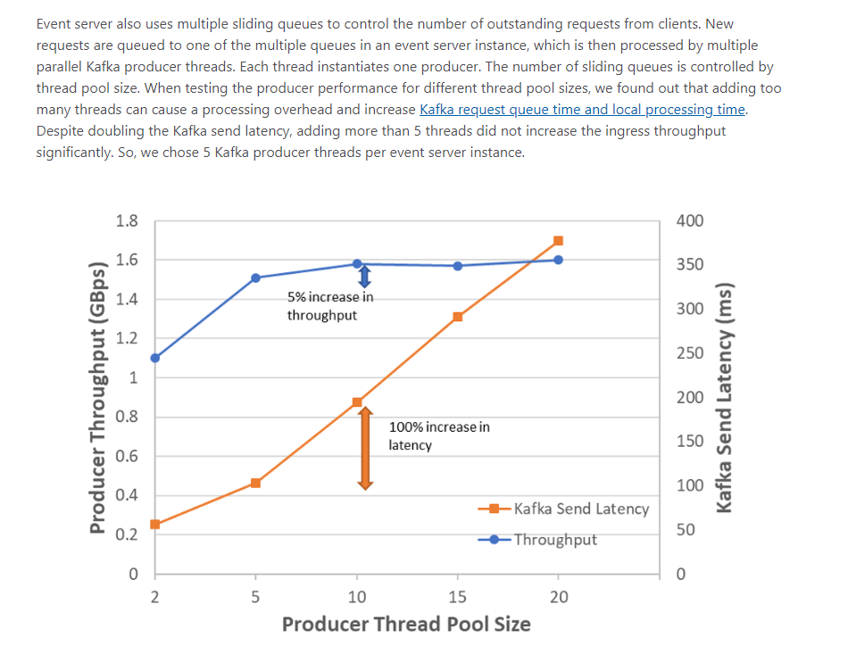

```
The producer is <i>thread safe</i> and sharing a single producer instance across threads will generally be faster than
* having multiple instances.
```

0.8的producer多实例是能增加吞吐,0.9宣称单实例可以"faster"。但是可能这个faster不是指能增加吞吐，待进一步测试



https://azure.microsoft.com/en-us/blog/processing-trillions-of-events-per-day-with-apache-kafka-on-azure/

> Event server also uses multiple sliding queues to control the number of outstanding requests from clients. New requests are queued to one of the multiple queues in an event server instance, which is then processed by multiple parallel Kafka producer threads. Each thread instantiates one producer. The number of sliding queues is controlled by thread pool size. When testing the producer performance for different thread pool sizes, we found out that adding too many threads can cause a processing overhead and increase Kafka request queue time and local processing time. Despite doubling the Kafka send latency, adding more than 5 threads did not increase the ingress throughput significantly. So, we chose 5 Kafka producer threads per event server instance.


- Batch.size
- Acks
- Compression.type
- Max.request.size
- Linger.ms
- Buffer.memory