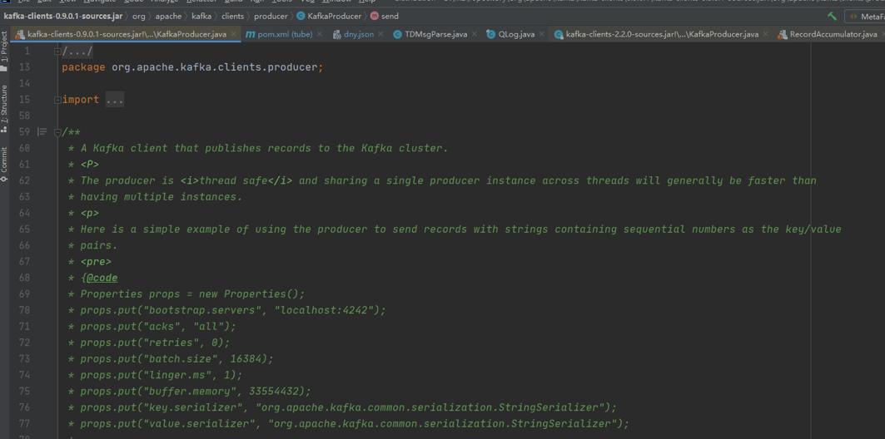
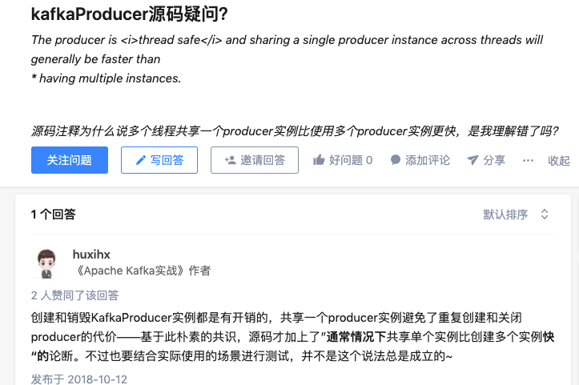

```
The producer is <i>thread safe</i> and sharing a single producer instance across threads will generally be faster than
* having multiple instances.
```

0.8的producer多实例是能增加吞吐,0.9宣称单实例可以"faster"。但是可能这个faster不是指能增加吞吐，待进一步测试
