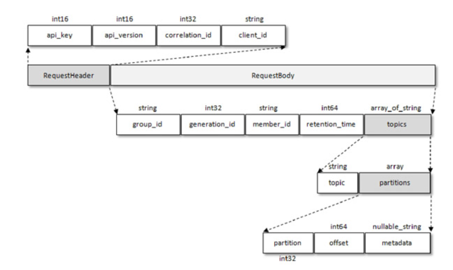
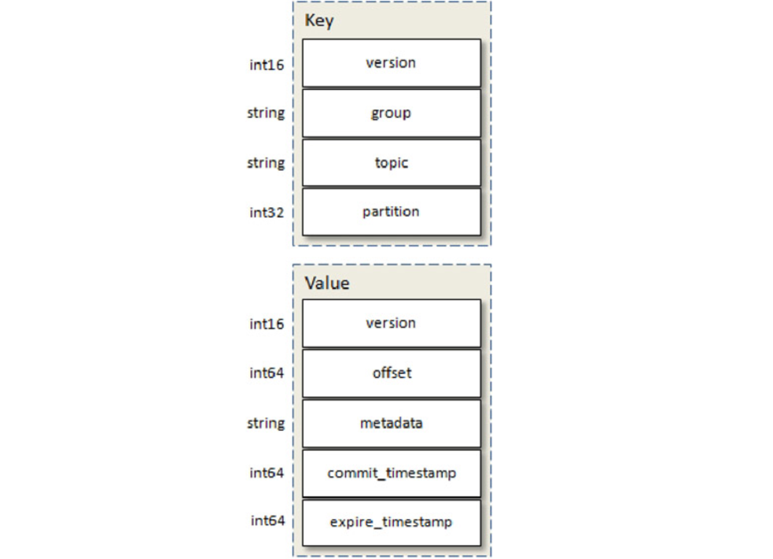

# `__consumer_offsets`剖析

offsets提交的内容最终会保存到Kafka的内部主题__consumer_offsets中。

对于Topic `__consumer_offsets`的深度掌握也可以让我们更好地理解和使用好offsets提交

## 1、`__consumer_offsets` topic创建
当集群中第一次有消费者消费消息时会自动创建主题`__consumer_offsets`。topic与如下参数相关:
- 副本数受offsets.topic.replication.factor参数的约束(默认为3)
- 分区数受offsets.topic.num.partitions参数设置，默认为50

 

## 2、OffsetCommitRequest offset提交请求
客户端提交消费位移是使用 OffsetCommitRequest 请求实现的，OffsetCommitRequest 的结构如图所示

- group_id、generation_id和member_id 不详细介绍
- retention_time 表示当前提交的消费位移所能保留的时长。保持为-1,值由服务端控制(offsets.retention.minutes)
    > 注意这个参数在2.0.0版本之前的默认值为1440，即1天，很多关于消费位移的异常也是由这个参数的值配置不当造成的。

## 3、`__consumer_offsets`消息格式

可以使用`kafka-console-consumer.sh`读取消息,不过要指定`formatter`为`kafka.coordinator.group.GroupMetadataManager$OffsetsMessageFormatter`才能正常解析出消息。

Kafka中有一个名为`delete-expired-group-metadata`的定时任务来负责清理过期的消费位移。
这个定时任务的执行周期由参数`offsets.retention.check.interval.ms`控制，默认值为600000，即10分钟。