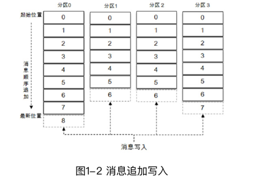
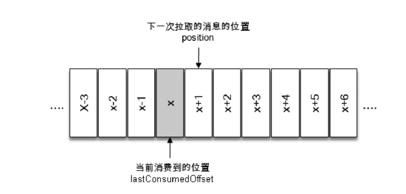

# 独立的总结(misc)

- 同一主题下的不同分区包含的消息是不同的，分区在存储层面可以看作一个可追加的日志（Log）文件，消息在被追加到分区日志文件的时候都会分配一个特定的偏移量（offset）。
- offset是消息在分区中的唯一标识，Kafka通过它来保证消息在分区内的顺序性，不过offset并不跨越分区，也就是说，Kafka保证的是分区有序而不是主题有序。

- KafkaProducer是线程安全的，可以在多个线程中共享单个KafkaProducer实例，也可以将KafkaProducer实例进行池化来供其他线程调用。
- Future 表示一个任务的生命周期，并提供了相应的方法来判断任务是否已经完成或取消，以及获取任务的结果和取消任务等。既然KafkaProducer.send（）方法的返回值是一个Future类型的对象，那么完全可以用Java语言层面的技巧来丰富应用的实现，比如使用Future中的get（long timeout，TimeUnit unit）方法实现可超时的阻塞。

- onCompletion()方法的两个参数是互斥的，消息发送成功时，metadata 不为 null 而exception为null；消息发送异常时，metadata为null而exception不为null。

- 回调函数的调用也可以保证分区有序。 (对于同一个分区而言，前一个send的callback一定在前面调用)
- close()方法会阻塞等待之前所有的发送请求完成后再关闭 KafkaProducer
- 如果调用了带超时时间timeout的close（）方法，那么只会在等待timeout时间内来完成所有尚未完成的请求处理，然后强行退出。在实际应用中，一般使用的都是无参的close（）方法。

- 生产者需要用序列化器（Serializer）把对象转换成字节数组才能通过网络发送给Kafka。而在对侧，消费者需要用反序列化器（Deserializer）把从 Kafka 中收到的字节数组转换成相应的对象。
- 如果 key 不为 null，那么默认的分区器会对 key 进行哈希（采用MurmurHash2算法，具备高运算性能及低碰撞率），最终根据得到的哈希值来计算分区号，拥有相同key的消息会被写入同一个分区。如果key为null，那么消息将会以轮询的方式发往主题内的各个可用分区。 
    > 后面producer过程会详细介绍

- Sender 从 RecordAccumulator 中获取缓存的消息之后，会进一步将原本＜分区，Deque＜ProducerBatch＞＞的保存形式转变成＜Node，List＜ ProducerBatch＞的形式，其中Node表示Kafka集群的broker节点。
    > 某个版本之后开始的优化，方便kafka后端存储优化                                                                

- 请求在从Sender线程发往Kafka之前还会保存到InFlightRequests中，InFlightRequests保存对象的具体形式为 Map＜NodeId，Deque＜Request＞＞，它的主要作用是缓存了已经发出去但还没有收到响应的请求（NodeId 是一个 String 类型，表示节点的 id 编号）。

- 元数据是指Kafka集群的元数据，这些元数据具体记录了集群中有哪些主题，这些主题有哪些分区，每个分区的leader副本分配在哪个节点上，follower副本分配在哪些节点上，哪些副本在AR、ISR等集合中，集群中有哪些节点，控制器节点又是哪一个等信息。

- acks=-1或acks=all。生产者在消息发送之后，需要等待ISR中的所有副本都成功写入消息之后才能够收到来自服务端的成功响应。

- 一般而言，在需要保证消息顺序的场合建议把参数max.in.flight.requests.per.connection配置为1，而不是把acks配置为0，不过这样也会影响整体的吞吐。

- 消费者客户端KafkaConsumer而言，它是非线程安全的

- 每一个分区只能被一个消费组中的一个消费者所消费。

- 对于消息中间件而言，一般有两种消息投递模式：点对点（P2P，Point-to-Point）模式和发布/订阅（Pub/Sub）模式。
    - 点对点模式是基于队列的，消息生产者发送消息到队列，消息消费者从队列中接收消息。
    - 发布/订阅模式在消息的一对多广播时采用。

- Kafka 0.9.x版本开始推出的使用Java编写的客户端，我们可以称之为新消费者客户端（New Consumer）或Java消费者客户端，它弥补了旧客户端中存在的诸多设计缺陷。

- 在实际应用中，在Kafka提供的序列化器和反序列化器满足不了应用需求的前提下，推荐使用Avro、JSON、Thrift、ProtoBuf或Protostuff等通用的序列化工具来包装，以求尽可能实现得更加通用且前后兼容。

- (消费数据时) 可以简单地认为poll（）方法只是拉取一下消息而已，但就其内部逻辑而言并不简单，它涉及消费位移、消费者协调器、组协调器、消费者的选举、分区分配的分发、再均衡的逻辑、心跳等内容

- 在每次调用poll（）方法时，它返回的是还没有被消费过的消息集（当然这个前提是消息已经存储在Kafka 中了，并且暂不考虑异常情况的发生），要做到这一点，就需要记录上一次消费时的消费位移。

- 不过需要非常明确的是，当前消费者需要提交的消费位移并不是 x，而是 x+1

- 在 Kafka 中默认的消费位移的提交方式是自动提交，这个由消费者客户端参数enable.auto.commit 配置，默认值为 true。
- 这个定期的周期时间由客户端参数auto.commit.interval.ms配置，默认值为5秒，此参数生效的前提是enable.auto.commit参数为true。

- 【不推荐】多个消费线程同时消费同一个分区，这个通过 assign（）、seek（）等方法实现，这样可以打破原有的消费线程的个数不能超过分区数的限制，进一步提高了消费的能力。

- Kafka从0.10.x版本开始支持指定broker的机架信息（机架的名称）

- 在Kafka的内部做埋点时会根据主题的名称来命名metrics的名称，并且会将点号`.`改成下画线`_`。假设遇到一个名称为`topic.1_2`的主题，还有一个名称为`topic_1.2`的主题，那么最后的metrics的名称都会为`topic_1_2`，这样就发生了名称冲突。
- topic的命名不推荐（虽然可以这样做）使用双下画线`__`开头，因为以双下画线开头的主题一般看作Kafka的内部主题，比如`__consumer_offsets`和`__transaction_state`。主题的名称必须由大小写字母、数字、点号`.`、连接线`-`、下画线`_`组成，不能为空，不能只有点号`.`，也不能只有双点号`..`，且长度不能超过249。

- 如果要删除的主题是 Kafka 的内部主题，那么删除时就会报错。截至 Kafka 2.0.0，Kafka的内部一共包含2个主题，分别为`__consumer_offsets`和`__transaction_state`。

-  Kafka 0.11.0.0 版本之前，通过 kafka-core 包（Kafka 服务端代码）下的kafka.admin.AdminClient和kafka.admin.AdminUtils来实现部分Kafka的管理功能，但它们都已经过时了，在未来的版本中会被删除。
- 从 0.11.0.0 版本开始，Kafka 提供了另一个工具类org.apache.kafka.clients.admin.KafkaAdminClient来作为替代方案。KafkaAdminClient不仅可以用来管理broker、配置和ACL（Access Control List），还可以用来管理主题。
    > 不建议再维护0.11.0.0之前的kafka版本                                                                                            

                                                                                                                                                                                                                               