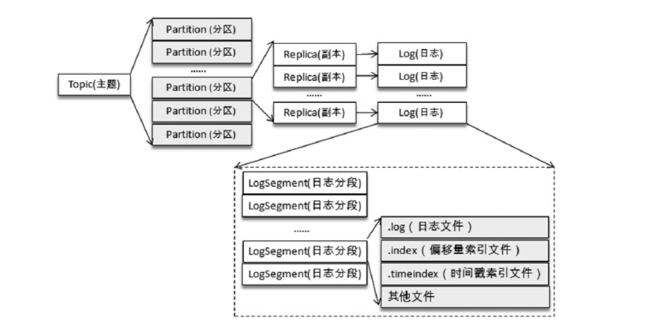
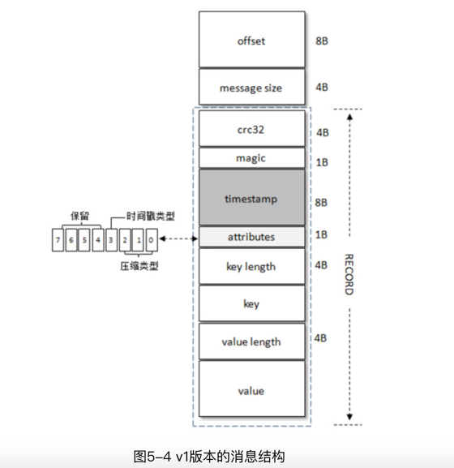
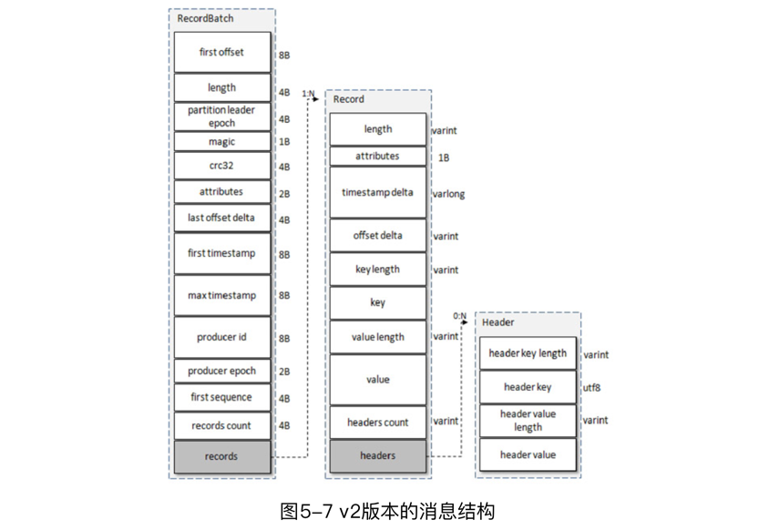
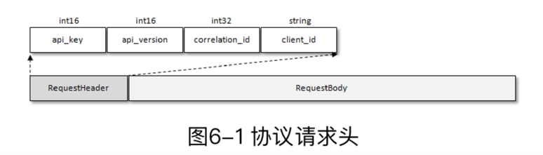
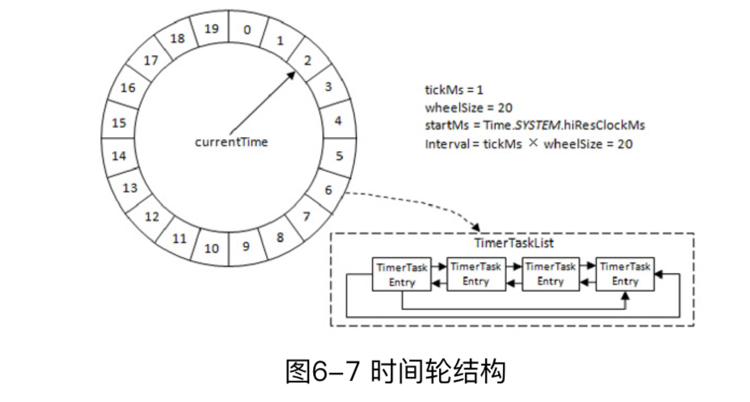
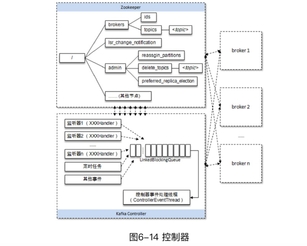
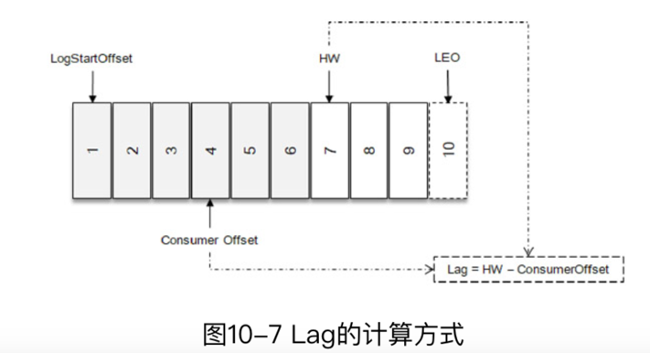

# 独立的笔记(misc)

- 同一主题下的不同分区包含的消息是不同的，分区在存储层面可以看作一个可追加的日志（Log）文件，消息在被追加到分区日志文件的时候都会分配一个特定的偏移量（offset）。
- offset是消息在分区中的唯一标识，Kafka通过它来保证消息在分区内的顺序性，不过offset并不跨越分区，也就是说，Kafka保证的是分区有序而不是主题有序。

- KafkaProducer是线程安全的，可以在多个线程中共享单个KafkaProducer实例，也可以将KafkaProducer实例进行池化来供其他线程调用。
- Future 表示一个任务的生命周期，并提供了相应的方法来判断任务是否已经完成或取消，以及获取任务的结果和取消任务等。既然KafkaProducer.send（）方法的返回值是一个Future类型的对象，那么完全可以用Java语言层面的技巧来丰富应用的实现，比如使用Future中的get（long timeout，TimeUnit unit）方法实现可超时的阻塞。

- onCompletion()方法的两个参数是互斥的，消息发送成功时，metadata 不为 null 而exception为null；消息发送异常时，metadata为null而exception不为null。

- 回调函数的调用也可以保证分区有序。 (对于同一个分区而言，前一个send的callback一定在前面调用)
- close()方法会阻塞等待之前所有的发送请求完成后再关闭 KafkaProducer
- 如果调用了带超时时间timeout的close（）方法，那么只会在等待timeout时间内来完成所有尚未完成的请求处理，然后强行退出。在实际应用中，一般使用的都是无参的close（）方法。

- 生产者需要用序列化器（Serializer）把对象转换成字节数组才能通过网络发送给Kafka。而在对侧，消费者需要用反序列化器（Deserializer）把从 Kafka 中收到的字节数组转换成相应的对象。
- 如果 key 不为 null，那么默认的分区器会对 key 进行哈希（采用MurmurHash2算法，具备高运算性能及低碰撞率），最终根据得到的哈希值来计算分区号，拥有相同key的消息会被写入同一个分区。如果key为null，那么消息将会以轮询的方式发往主题内的各个可用分区。 
    > 后面producer过程会详细介绍

- Sender 从 RecordAccumulator 中获取缓存的消息之后，会进一步将原本＜分区，Deque＜ProducerBatch＞＞的保存形式转变成＜Node，List＜ ProducerBatch＞的形式，其中Node表示Kafka集群的broker节点。
    > 某个版本之后开始的优化，方便kafka后端存储优化                                                                

- 请求在从Sender线程发往Kafka之前还会保存到InFlightRequests中，InFlightRequests保存对象的具体形式为 Map＜NodeId，Deque＜Request＞＞，它的主要作用是缓存了已经发出去但还没有收到响应的请求（NodeId 是一个 String 类型，表示节点的 id 编号）。

- 元数据是指Kafka集群的元数据，这些元数据具体记录了集群中有哪些主题，这些主题有哪些分区，每个分区的leader副本分配在哪个节点上，follower副本分配在哪些节点上，哪些副本在AR、ISR等集合中，集群中有哪些节点，控制器节点又是哪一个等信息。

- acks=-1或acks=all。生产者在消息发送之后，需要等待ISR中的所有副本都成功写入消息之后才能够收到来自服务端的成功响应。

- 一般而言，在需要保证消息顺序的场合建议把参数max.in.flight.requests.per.connection配置为1，而不是把acks配置为0，不过这样也会影响整体的吞吐。

- 消费者客户端KafkaConsumer而言，它是非线程安全的

- 每一个分区只能被一个消费组中的一个消费者所消费。

- 对于消息中间件而言，一般有两种消息投递模式：点对点（P2P，Point-to-Point）模式和发布/订阅（Pub/Sub）模式。
    - 点对点模式是基于队列的，消息生产者发送消息到队列，消息消费者从队列中接收消息。
    - 发布/订阅模式在消息的一对多广播时采用。

- Kafka 0.9.x版本开始推出的使用Java编写的客户端，我们可以称之为新消费者客户端（New Consumer）或Java消费者客户端，它弥补了旧客户端中存在的诸多设计缺陷。

- 在实际应用中，在Kafka提供的序列化器和反序列化器满足不了应用需求的前提下，推荐使用Avro、JSON、Thrift、ProtoBuf或Protostuff等通用的序列化工具来包装，以求尽可能实现得更加通用且前后兼容。

- (消费数据时) 可以简单地认为poll（）方法只是拉取一下消息而已，但就其内部逻辑而言并不简单，它涉及消费位移、消费者协调器、组协调器、消费者的选举、分区分配的分发、再均衡的逻辑、心跳等内容

- 在每次调用poll（）方法时，它返回的是还没有被消费过的消息集（当然这个前提是消息已经存储在Kafka 中了，并且暂不考虑异常情况的发生），要做到这一点，就需要记录上一次消费时的消费位移。

- 不过需要非常明确的是，当前消费者需要提交的消费位移并不是 x，而是 x+1

- 在 Kafka 中默认的消费位移的提交方式是自动提交，这个由消费者客户端参数enable.auto.commit 配置，默认值为 true。
- 这个定期的周期时间由客户端参数auto.commit.interval.ms配置，默认值为5秒，此参数生效的前提是enable.auto.commit参数为true。

- 【不推荐】多个消费线程同时消费同一个分区，这个通过 assign（）、seek（）等方法实现，这样可以打破原有的消费线程的个数不能超过分区数的限制，进一步提高了消费的能力。

- Kafka从0.10.x版本开始支持指定broker的机架信息（机架的名称）

- 在Kafka的内部做埋点时会根据主题的名称来命名metrics的名称，并且会将点号`.`改成下画线`_`。假设遇到一个名称为`topic.1_2`的主题，还有一个名称为`topic_1.2`的主题，那么最后的metrics的名称都会为`topic_1_2`，这样就发生了名称冲突。
- topic的命名不推荐（虽然可以这样做）使用双下画线`__`开头，因为以双下画线开头的主题一般看作Kafka的内部主题，比如`__consumer_offsets`和`__transaction_state`。主题的名称必须由大小写字母、数字、点号`.`、连接线`-`、下画线`_`组成，不能为空，不能只有点号`.`，也不能只有双点号`..`，且长度不能超过249。

- 如果要删除的主题是 Kafka 的内部主题，那么删除时就会报错。截至 Kafka 2.0.0，Kafka的内部一共包含2个主题，分别为`__consumer_offsets`和`__transaction_state`。

-  Kafka 0.11.0.0 版本之前，通过 kafka-core 包（Kafka 服务端代码）下的kafka.admin.AdminClient和kafka.admin.AdminUtils来实现部分Kafka的管理功能，但它们都已经过时了，在未来的版本中会被删除。
- 从 0.11.0.0 版本开始，Kafka 提供了另一个工具类org.apache.kafka.clients.admin.KafkaAdminClient来作为替代方案。KafkaAdminClient不仅可以用来管理broker、配置和ACL（Access Control List），还可以用来管理主题。
    > 不建议再维护0.11.0.0之前的kafka版本                                                                                            

- 分区使用多副本机制来提升可靠性，但只有leader副本对外提供读写服务，而follower副本只负责在内部进行消息的同步。
- 针对同一个分区而言，同一个broker节点中不可能出现它的多个副本，即Kafka集群的一个broker中最多只能有它的一个副本，我们可以将leader副本所在的broker节点叫作分区的leader节点，而follower副本所在的broker节点叫作分区的follower节点。
- Kafka 集群的broker 节点不可避免地会遇到宕机或崩溃的问题，当分区的leader节点发生故障时，其中一个follower节点就会成为新的leader节点，这样就会导致集群的负载不均衡，从而影响整体的健壮性和稳定性。
- 就算集群中的分区分配均衡、leader 分配均衡，也并不能确保整个集群的负载就是均衡的，还需要其他一些硬性的指标来做进一步的衡量。
- 在生产环境中不建议将`auto.leader.rebalance.enable`设置为默认的true，因为这可能引起负面的性能问题，也有可能引起客户端一定时间的阻塞。
- Kafka中`kafka-perferred-replica-election.sh`脚本提供了对分区leader副本进行重新平衡的功能。
- 在优先副本的选举过程中，具体的元数据信息会被存入 ZooKeeper的/admin/preferred_replica_election节点，如果这些数据超过了ZooKeeper节点所允许的大小，那么选举就会失败。默认情况下ZooKeeper所允许的节点数据大小为1MB。
- Kafka提供了 `kafka-reassign-partitions.sh` 脚本来执行分区重分配的工作，它可以在集群扩容、broker节点失效的场景下对分区进行迁移。

- 如何选择合适的分区数？这是很多Kafka的使用者经常面临的问题，不过对这个问题而言，似乎并没有非常权威的答案。(依赖经验)
- 抛开硬件资源的影响，消息写入的吞吐量还会受到消息大小、消息压缩方式、消息发送方式（同步/异步）、消息确认类型（acks）、副本因子等参数的影响，消息消费的吞吐量还会受到应用逻辑处理速度的影响
- 分区数越多并不会使吞吐量一直增长。具体吞吐量的数值和走势还会和磁盘、文件系统、I/O调度策略相关。
- 一个分区对应一个日志（Log）。为了防止 Log 过大，Kafka又引入了日志分段（LogSegment）的概念，将Log切分为多个LogSegment，相当于一个巨型文件被平均分配为多个相对较小的文件
- Log 在物理上只以文件夹的形式存储，而每个LogSegment 对应于磁盘上的一个日志文件和两个索引文件，以及可能的其他文件（比如以“.txnindex”为后缀的事务索引文件）

- 最后一个 LogSegment 称为“activeSegment”，即表示当前活跃的日志分段

- 消息格式也在不断升级改进，从0.8.x版本开始到现在的2.0.0版本，Kafka的消息格式也经历了3个版本：v0版本、v1版本和v2版本。
- Kafka消息格式的第一个版本通常称为v0版本，在Kafka 0.10.0之前都采用的这个消息格式（在0.8.x版本之前，Kafka还使用过一个更古老的消息格式，不过对目前的Kafka而言，我们也不需要了解这个版本的消息格式）

- Kafka从0.10.0版本开始到0.11.0版本之前所使用的消息格式版本为v1，比v0版本就多了一个timestamp字段，表示消息的时间戳。
      
- v1 版本的消息的最小长度（RECORD_OVERHEAD_V1）要比 v0 版本的大 8 个字节，即22B。
- Kafka从0.11.0版本开始所使用的消息格式版本为v2，改动很大

- v2版本的消息不仅提供了更多的功能，比如事务、幂等性等，某些情况下还减少了消息的空间占用，总体性能提升很大。                                                                                                                                                                                                                   

- 偏移量索引文件用来建立消息偏移量（offset）到物理地址之间的映射关系，方便快速定位消息所在的物理文件位置；时间戳索引文件则根据指定的时间戳（timestamp）来查找对应的偏移量信息。
- Kafka 中的索引文件以稀疏索引（sparse index）的方式构造消息的索引，它并不保证每个消息在索引文件中都有对应的索引项。
- 稀疏索引通过MappedByteBuffer将索引文件映射到内存中，以加快索引的查询速度。偏移量索引文件中的偏移量是单调递增的，查询指定偏移量时，使用二分查找法来快速定位偏移量的位置，如果指定的偏移量不在索引文件中，则会返回小于指定偏移量的最大偏移量。
- Kafka 的每个日志对象中使用了ConcurrentSkipListMap来保存各个日志分段，每个日志分段的baseOffset作为key，这样可以根据指定偏移量来快速定位到消息所在的日志分段。

- Kafka 强制要求索引文件大小必须是索引项大小的整数倍，对偏移量索引文件而言，必须为8的整数倍。如果broker端参数log.index.size.max.bytes配置为67，那么Kafka在内部会将其转换为64，即不大于67，并且满足为8的整数倍的条件。
- 与偏移量索引文件相似，时间戳索引文件大小必须是索引项大小（12B）的整数倍，如果不满足条件也会进行裁剪。同样假设broker端参数log.index.size.max.bytes配置为67，那么对应于时间戳索引文件，Kafka在内部会将其转换为60。
- 日志压缩（Log Compaction）：针对每个消息的key进行整合，对于有相同key的不同value值，只保留最后一个版本。(可以类比于Redis中的RDB的持久化模式。试想一下，如果一个系统使用 Kafka 来保存状态，那么每次有状态变更都会将其写入 Kafka。)
- 当前日志分段的保留策略有3种：基于时间的保留策略、基于日志大小的保留策略和基于日志起始偏移量的保留策略。
- Kafka提供了一个墓碑消息（tombstone）的概念，如果一条消息的key不为null，但是其value为null，那么此消息就是墓碑消息。
- Kafka 中大量使用了页缓存，这是 Kafka 实现高吞吐的重要因素之一。即使Kafka服务重启，页缓存还是会保持有效，然而进程内的缓存却需要重建。
- Kafka还使用零拷贝（Zero-Copy）技术来进一步提升性能。对 Linux操作系统而言，零拷贝技术依赖于底层的 sendfile（）方法实现。对应于 Java 语言，FileChannal.transferTo（）方法的底层实现就是sendfile（）方法。
- 在目前的 Kafka 2.0.0 中，一共包含了 43 种协议类型，每种协议类型都有对应的请求（Request）和响应（Response），它们都遵守特定的协议模式。每种类型的Request都包含相同结构的协议请求头（RequestHeader）和不同结构的协议请求体（RequestBody）。

- 除了Kafka客户端开发人员，绝大多数的其他开发人员基本接触不到或不需要接触具体的协议，那么我们为什么还要了解它们呢？其实，协议的具体定义可以让我们从另一个角度来了解Kafka的本质。
- Kafka中最枯燥的莫过于它的上百个参数、几百个监控指标和几十种请求协议，掌握这三者的“套路”，相信你会对Kafka有更深入的理解。
- Kafka中的时间轮（TimingWheel）是一个存储定时任务的环形队列，底层采用数组实现，数组中的每个元素可以存放一个定时任务列表（TimerTaskList）。TimerTaskList是一个环形的双向链表，链表中的每一项表示的都是定时任务项（TimerTaskEntry），其中封装了真正的定时任务（TimerTask）。

- TimingWheel 在创建的时候以当前系统时间为第一层时间轮的起始时间（startMs），这里的当前系统时间并没有简单地调用 System.currentTimeMillis（），而是调用了Time.SYSTEM.hiResClockMs，这是因为 currentTimeMillis（）方法的时间精度依赖于操作系统的具体实现，有些操作系统下并不能达到毫秒级的精度，而Time.SYSTEM.hiResClockMs实质上采用了System.nanoTime（）/1_000_000来将精度调整到毫秒级。
- Kafka中的定时器借了JDK中的DelayQueue来协助推进时间轮。具体做法是对于每个使用到的TimerTaskList都加入DelayQueue，“每个用到的TimerTaskList”特指非哨兵节点的定时任务项TimerTaskEntry对应的TimerTaskList。
- 在将消息写入 leader 副本的本地日志文件之后，Kafka会创建一个延时的生产操作（DelayedProduce），用来处理消息正常写入所有副本或超时的情况，以返回相应的响应结果给客户端。
- 在Kafka中将延时操作管理器称为DelayedOperationPurgatory，这个名称比之前提及的ExpiredOperationReaper和SkimpyOffsetMap的取名更有意思。Purgatory直译为“炼狱”，但丁的《神曲》中有炼狱的相关描述。炼狱共有9层，在生前犯有罪过但可以得到宽恕的灵魂，按照人类的七宗罪（傲慢、忌妒、愤怒、怠惰、贪财、贪食、贪色）分别在这里修炼洗涤，而后一层层升向光明和天堂。Kafka 中采用这一称谓，将延时操作看作需要被洗涤的灵魂，在炼狱中慢慢修炼，等待解脱升入天堂（即完成延时操作）
- Kafka中的控制器选举工作依赖于ZooKeeper，成功竞选为控制器的broker会在ZooKeeper中创建/controller这个临时（EPHEMERAL）节点
- 具备控制器身份的broker需要比其他普通的broker多一份职责:监听分区相关的变化、监听主题相关的变化、监听broker相关的变化、从ZooKeeper中读取获取当前所有与主题、分区及broker有关的信息并进行相应的管理、启动并管理分区状态机和副本状态机、更新集群的元数据信息、维护分区的优先副本的均衡(auto.leader.rebalance.enable 设置为 true)
- 在Kafka的早期版本中，并没有采用Kafka Controller这样一个概念来对分区和副本的状态进行管理，而是依赖于ZooKeeper，会有脑裂、羊群效应

- Kafka提供了消费者客户端参数partition.assignment.strategy来设置消费者与订阅主题之间的分区分配策略。默认情况下，此参数的值为org.apache.kafka.clients.consumer.RangeAssignor，即采用RangeAssignor分配策略。
- 为了实现生产者的幂等性，Kafka为此引入了producer id（以下简称PID）和序列号（sequencenumber）这两个概念.
- 事务可以保证对多个分区写入操作的原子性。操作的原子性是指多个操作要么全部成功，要么全部失败，不存在部分成功、部分失败的可能。参考文档: https：//cwiki.apache.org/confluence/display/KAFKA/KIP-98+-+Exactly+Once+Delivery+and+Transactional+Messaging
- Kafka 只支持主写主读有几个优点：可以简化代码的实现逻辑，减少出错的可能；将负载粒度细化均摊，与主写从读相比，不仅负载效能更好，而且对用户可控；没有延时的影响；在副本稳定的情况下，不会出现数据不一致的情况。为此，Kafka 又何必再去实现对它而言毫无收益的主写从读的功能呢？这一切都得益于 Kafka 优秀的架构设计，从某种意义上来说，主写从读是由于设计上的缺陷而形成的权宜之计。
- 通常情况下，只要leader不宕机我们就不需要关心follower的同步问题。不过当leader宕机时，我们就要从follower中选举出一个新的leader。follower的同步状态可能落后leader很多，甚至还可能处于宕机状态，所以必须确保选择具有最新日志消息的follower作为新的leader。
- 任何东西不可能做到完全的可靠，即使能应付单机故障，也难以应付集群、数据中心等集体故障，即使躲得过天灾也未必躲得过人祸。就可靠性而言，我们可以基于一定的假设前提来做分析。
- 对于消息的可靠性，很多人都会忽视消费端的重要性，如果一条消息成功地写入 Kafka，并且也被Kafka完好地保存，而在消费时由于某些疏忽造成没有消费到这条消息，那么对于应用来说，这条消息也是丢失的。
- enable.auto.commit 参数的默认值为 true，即开启自动位移提交的功能，虽然这种方式非常简便，但它会带来重复消费和消息丢失的问题，对于高可靠性要求的应用来说显然不可取，所以需要将 enable.auto.commit 参数设置为 false 来执行手动位移提交。
- 对于消费端，Kafka 还提供了一个可以兜底的功能，即回溯消费，通过这个功能可以让我们能够有机会对漏掉的消息相应地进行回补，进而可以进一步提高可靠性。
- Kafka 自身提供的监控指标（包括broker和主题的指标，而集群层面的指标可以通过各个broker的指标值累加来获得）都可以通过JMX（Java Managent Extension，Java管理扩展）来获取，在使用JMX之前需要确保Kafka开启了JMX的功能（默认关闭）。
- 消息堆积是消费滞后（Lag）的一种表现形式，消息中间件中留存的消息与消费的消息之间的差值即为消息堆积量，也称为消费滞后（Lag）量。

> HighWatermark：简称HW，代表消费端所能“观察”到的Partition的最高日志位移.LogEndOffset：简称LEO, 代表Partition的最高日志位移，其值对消费者不可见。

- 目前与消息审计有关的产品也有多个，比如Chaperone（Uber）、Confluent Control Center、Kafka Monitor（LinkedIn），它们主要通过在消息体（value字段）或在消息头（headers字段）中内嵌消息对应的时间戳timestamp或全局的唯一标识ID（或者是两者兼备）来实现消息的审计功能。