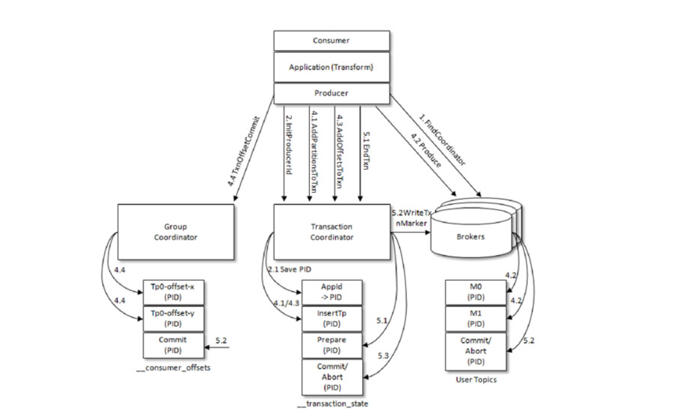

# 事务
> kafka官方设计文档 https：//cwiki.apache.org/confluence/display/KAFKA/KIP-98+-+Exactly+Once+Delivery+and+Transactional+Messaging

Kafka 的事务可以看作Kafka 中最难的知识点之一!

## 消息传输保障
一般而言，消息中间件的消息传输保障有3个层级:
- at most once：至多一次。消息可能会丢失，但绝对不会重复传输
- at least once：最少一次。消息绝不会丢失，但可能会重复传输
- exactly once：恰好一次。每条消息肯定会被传输一次且仅传输一次

Kafka 的消息传输保障机制非常直观。当生产者向 Kafka 发送消息时，一旦消息被成功提交到日志文件，由于多副本机制的存在，这条消息就不会丢失。

Kafka从0.11.0.0版本开始引入了幂等和事务这两个特性，以此来实现EOS（exactly oncesemantics，精确一次处理语义）。

## 幂等
所谓的幂等，简单地说就是对接口的多次调用所产生的结果和调用一次是一致的。生产者在进行重试的时候有可能会重复写入消息，而使用Kafka的幂等性功能之后就可以避免这种情况。

为了实现生产者的幂等性，Kafka为此引入了
- producer id
- 序列号（sequencenumber）这两个概念
> (在早期的kafka版本中，我们在业务层也实现了类似的header信息来实现业务层幂等。当然这部分kafka原生实现的源码也值得一看，对比看看有何优劣!)

客户端需要开启`enable.idempotence`为true。

## 事务
幂等性并不能跨多个分区运作，而事务可以弥补这个缺陷。事务可以保证对多个分区写入操作的原子性。操作的原子性是指多个操作要么全部成功，要么全部失败，不存在部分成功、部分失败的可能。

为了实现事务，应用程序必须提供唯一的 transactionalId，这个 transactionalId 通过客户端参数transactional.id来显式设置。一个完整的使用代码参考如下：
```java
// TBD
```



步骤:
- 查找TransactionCoordinator
- 获取并保存PID
- 开启事务
- Consume-Transform-Produce