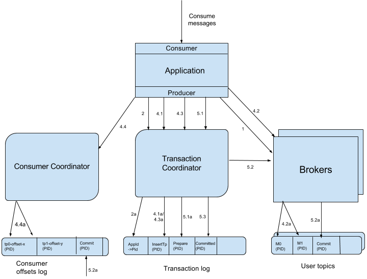

# 事务
> kafka官方设计文档 [kip-98](https://cwiki.apache.org/confluence/display/KAFKA/KIP-98+-+Exactly+Once+Delivery+and+Transactional+Messaging)。大家可以先阅读我这篇文章，再去啃kip原文。

Kafka 的事务可以看作Kafka 中最难的知识点之一!

## 消息传输保障
一般而言，消息中间件的消息传输保障有3个层级:
- at most once：至多一次。消息可能会丢失，但绝对不会重复传输
- at least once：最少一次。消息绝不会丢失，但可能会重复传输
- exactly once：恰好一次。每条消息肯定会被传输一次且仅传输一次

Kafka 的消息传输保障机制非常直观。当生产者向 Kafka 发送消息时，一旦消息被成功提交到日志文件，由于多副本机制的存在，这条消息就不会丢失。

Kafka从0.11.0.0版本开始引入了幂等和事务这两个特性，以此来实现EOS（exactly oncesemantics，精确一次处理语义）。

## 幂等
所谓的幂等，简单地说就是对接口的多次调用所产生的结果和调用一次是一致的。生产者在进行重试的时候有可能会重复写入消息，而使用Kafka的幂等性功能之后就可以避免这种情况。

为了实现生产者的幂等性，Kafka为此引入了
- producer id
- 序列号（sequencenumber）这两个概念
> (在早期的kafka版本中，我们在业务层也实现了类似的header信息来实现业务层幂等。当然这部分kafka原生实现的源码也值得一看，对比看看有何优劣!)

客户端需要开启`enable.idempotence`为true。

为什么需要幂等？
因为事务开启后必然会有很多的失败重试

## 事务
> 幂等性并不能跨多个分区运作，而事务可以弥补这个缺陷。事务可以保证对多个分区写入操作的原子性。操作的原子性是指多个操作要么全部成功，要么全部失败，不存在部分成功、部分失败的可能。

### 解决什么问题？
- 多分区原子写入
- `consume-transform-produce` 原子操作
- 有状态应用多个会话之间的连续性
  > 如何理解： 如应用重启后可以接着幂等生产和事务恢复

### 设计思想
#### producer
- producer和transactionalId建议一一对应，因为一个TransactionalId只能有一个活跃的producer
- 应用实例die的情况下，新启动的实例会接管事务，继续未完成的事务(aborted或committed)

#### consumer
consumer 事务语义相对弱一些
- topic是compacted，老数据可能被新版本的数据覆盖
- 事务消息跨多个日志segment，可能其中部分segment过期被删除
- consumer消费可以指定offset消费。
  > 10条数据原子一个事务原子写入，但你指定从第9条数据开始消费，则1~8条数据不会被消费到。
- consumer不一定会同时消费所有一个事务生产的topic和分区

### 具体实现

#### 关键概念
为了支持事务，kafka新增加了如下模块：
- 新协调器：Transaction Coordinator，分配PID、管理事务
- 新内部topic：`__transaction_state` 持久化存储事务的日志
- 新消息类型： `ControlBatch`兼容老的`ProduceBatch`，写到用户的topic，告诉用于之前fetch的数据是否已经commit。详见[jira](https://issues.apache.org/jira/browse/KAFKA-1639)。 之前线上有个案例case，旧版本客户端消费该数据导致故障。
- 新id：transactionalId，唯一识别producer。旧producer挂了的情况下，同id的新producer继续未完成的事务。
- 新的epoch：producer epoch。通过版本号确定合法的事务producer(一个TransactionalId只能有一个活跃的producer)。
- 新的request类型、新的request版本号
- 新的消息格式

#### 案例与DataFlow
为了实现事务，应用程序必须提供唯一的 transactionalId，这个 transactionalId 通过客户端参数transactional.id来显式设置。一个完整的使用代码参考如下：
```java
// TBD，可以先看kip的示例
```


> 注意4.3和4.4是Consume-Transform-Produce场景独有的步骤，涉及到消费和生产的联动，这里我不多介绍。

步骤:
- 1、查找TransactionCoordinator
- 2、获取并保存PID
- 3、Producer开启事务
- 4、Consume-Transform-Produce(以该场景举例)
  - 4.1 AddPartitionsToTxnRequest：producer告诉事务协调器哪些tp会被写入，事务协调器会将这些信息存储，并启动一个事务的定时器。
  - 4.2 ProduceRequest。 与常规的Produce相比多了`PID\epoch\sequence number`字段
  - 4.3 AddOffsetCommitsToTxnRequest：批量消费和生产时使用到。
    > `sendOffsetsToTransaction(Map<TopicPartition, OffsetAndMetadata> offsets,
    String consumerGroupId)` 
  - 4.4 TxnOffsetCommitRequest
- 5、提交或取消一个事务
  - 5.1 EndTxnRequest：`endTransaction` \ `abortTransaction` 
    > `abortTransaction` 后 下游消费者读取后会丢弃掉对应的数据
    
    > 收到这个请求后，1）协调器将往事务日志里面写入`PREPARE_COMMIT`和`PREPARE_ABORT`消息。2）发送`COMMIT`或`ABORT`marker到用户的数据里面(即5.2)。3）事务日志写入`COMMITTED`和`ABORTED`消息。
  - 5.2 WriteTxnMarkerRequest
    > 事务协调器发给各个tp的leader的broker，broker收到后会往对应的topic里面插入`ControlBatch`(即marker)。告知该PID之前发送的消息的状态是怎么样的。注意：消费者需要缓存该PID的消息直到收到`ControlBatch`信息，才直到应该如何处理这些消息(业务处理or丢弃)。
  - 5.3 发送最终提交或取消请求
    > `ControlBatch`(即marker)写到tp里后，事务协调器会往事务日志里面写入`COMMITTED`和`ABORTED`消息，事务完成。

## 关键参数
### broker端
- transactional.id.timeout.ms：604800000 (7 days) 事务id在没有更新情况下存活的时间。

- max.transaction.timeout.ms：900000 (15 min) 最大事务的超时时间。

### producer端
- enable.idempotence： 幂等
> 默认会要求： acks=all retries > 1 max.inflight.requests.per.connection=1. 

- transaction.timeout.ms：事务超时时间，60000
- transactional.id：事务id

### consumer端
- isolation.level：默认read_uncommitted
  - read_uncommitted: 同时消费到committed和uncommitted的消息
  - read_committed：只能消费到非事务消息以及

## 性能测试
不难分析，kafka的事务是相对轻量的，对性能影响相对可控。
`kafka-producer-perf-test.sh`的 `--transactional-id` 用于测试并发事务的性能。
潜在性能下降点：单producer写入性能，特别是开启幂等后的性能下降。


