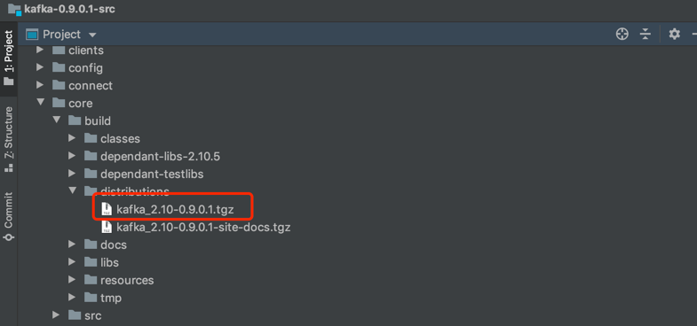

# 源码编译
> 记录0.9.0.1的编译过程

1、下载源码

2、安装gradle
```shell script
# mac下
brew install gradle
```
3、修改build.gradle
```log
> Failed to apply plugin [class 'org.gradle.api.plugins.scala.ScalaBasePlugin']  
   > No such property: useAnt for class: org.gradle.api.tasks.scala.ScalaCompileOptions
```
有相关报错需要修改build.gradle
```
ScalaCompileOptions.metaClass.daemonServer = true  
ScalaCompileOptions.metaClass.fork = true  
ScalaCompileOptions.metaClass.useAnt = false  
ScalaCompileOptions.metaClass.useCompileDaemon = false
```
4、gradle
执行一下`gradle`

5、配置代理(选)

6、打包编译
```shell script
./gradlew releaseTarGz -x signArchives
```
