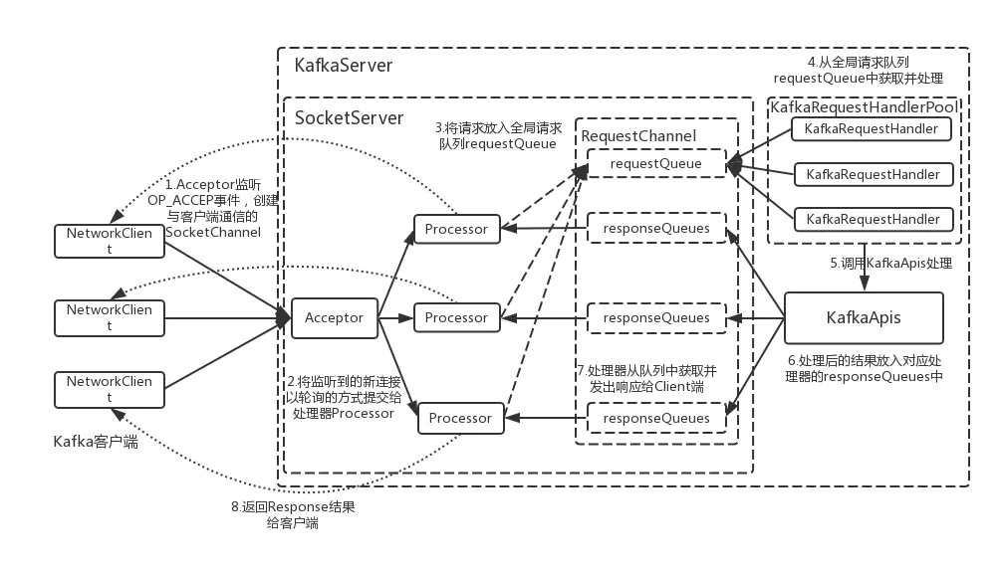

# 网络模型

kafka的网络通信模型是1（1个Acceptor线程）+N（N个Processor线程）+M（M个业务处理线程）。

|  线程数 |线程名   |线程具体说明|
| ------------ | ------------ |------------ |
|  1 | kafka-socket-acceptor_%x   |Acceptor线程，负责监听Client端发起的请求 |
|  N |kafka-network-thread_%d	 |Processor线程，负责对Socket进行读写 |
|  M |kafka-request-handler-_%d    |Worker线程，处理具体的业务逻辑并生成Response返回 |
